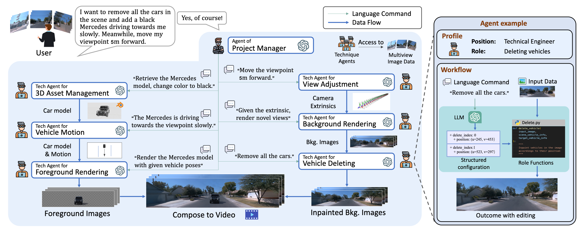
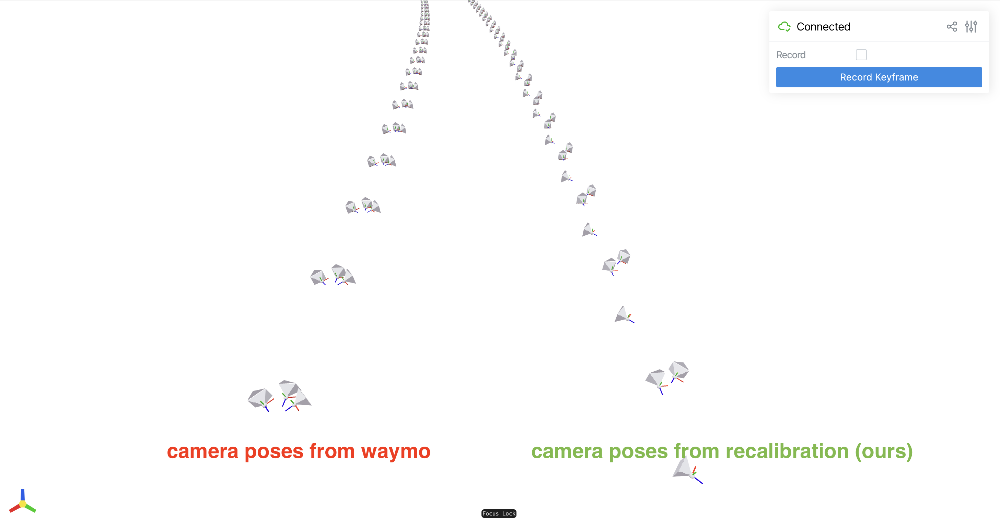

# ChatSim
Editable Scene Simulation for Autonomous Driving via LLM-Agent Collaboration

[Arxiv](https://arxiv.org/abs/2402.05746) | [Project Page](https://yifanlu0227.github.io/ChatSim/) | [Video](https://youtu.be/5xWz5YBsE5M)



## News
[06/12/2024] **background rendering speed up**: 3D Gaussian splatting is integrated as a background rendering engine, rendering 50 frames within 30s.

[06/12/2024] **foreground rendering speed up**: multiple process for blender rendering in parallel! rendering 50 frames within 5 minutes (8 x NVIDIA RTX 4090).

## Requirement
- Ubuntu version >= 20.04 (for using Blender 3.+)
- Python >= 3.8
- Pytorch >= 1.13
- CUDA >= 11.6
- COLMAP or Metashape software (not necessary, we provide recalibrated poses)
- OpenAI API Key (you can also use other models' API from [NVIDIA AI](https://build.nvidia.com/explore/reasoning) for free lunch)

## Installation
First clone this repo recursively.

```bash
git clone https://github.com/yifanlu0227/ChatSim.git --recursive
```

### Step 1: Setup environment
```bash
conda create -n chatsim python=3.9 git-lfs
conda activate chatsim
```

### Step 2: Install background rendering engine 

We offer two background rendering methods, one is `McNeRF` in our paper, and another is [`3D Gaussian Splatting`](https://github.com/graphdeco-inria/gaussian-splatting). `McNeRF` encodes the exposure time and achieves brightness-consistent rendering. `3D Gaussian Splatting` is much faster (**about 50 x**) in rendering and has higher PSNR in training views. However, strong perspective shifts result in noticeable artifacts. 


**McNeRF**


https://github.com/yifanlu0227/ChatSim/assets/45688237/6e7e4411-31e5-46e3-9ca2-be0d6e813a60

**3D Gaussian Splatting**

https://github.com/yifanlu0227/ChatSim/assets/45688237/e7ac487c-5615-455d-bb38-026aaaabce70

Installing either one is OK! If you want high rendering speed and do not care about brightness inconsistency, choose `3D Gaussian Splatting`. 

<details>
<summary><span style="font-weight: bold;"> McNeRF (official implement in the paper) </span> as background rendering engine </summary>
    
```bash
pip install torch==1.13.1+cu117 torchvision==0.14.1+cu117 torchaudio==0.13.1 --extra-index-url https://download.pytorch.org/whl/cu117

pip install -r requirements.txt
imageio_download_bin freeimage
```

The installation is the same as [F2-NeRF](https://github.com/totoro97/f2-nerf). Please go through the following steps.

```bash
cd chatsim/background/mcnerf/

# mcnerf use the same data directory. 
ln -s ../../../data .
```

#### Step 2.1: Install dependencies

For Debian based Linux distributions:
```
sudo apt install zlib1g-dev
```

For Arch based Linux distributions:
```
sudo pacman -S zlib
```

#### Step 2.2: Download pre-compiled LibTorch
Taking `torch-1.13.1+cu117` for example.
```bash
cd chatsim/background/mcnerf
cd External

# modify the verison if you use a different pytorch installation
wget https://download.pytorch.org/libtorch/cu117/libtorch-cxx11-abi-shared-with-deps-1.13.1%2Bcu117.zip
unzip ./libtorch-cxx11-abi-shared-with-deps-1.13.1+cu117.zip
rm ./libtorch-cxx11-abi-shared-with-deps-1.13.1+cu117.zip
```

#### Step 2.3: Compile
The lowest g++ version is 7.5.0. 
```shell
cd ..
cmake . -B build
cmake --build build --target main --config RelWithDebInfo -j
```
If the mcnerf code is modified, the last two lines should always be executed.

</details>

<details>
<summary><span style="font-weight: bold;"> 3D Gaussians Splatting </span>  as background rendering engine</summary>

**Much faster**, **higher rendering quality**, but HDR sky is not enabled in this case.

### Step 2: Faster alternative of McNeRF, 3D Gaussians splatting
This requires that your CUDA NVCC version matches your pytorch cuda version.
```bash
# make CUDA (nvcc) version consistent with the pytorch CUDA version.

# first check your CUDA (nvcc) version
nvcc -V # for example: Build cuda_11.8.r11.8

# go to https://pytorch.org/get-started/previous-versions/ to find a corresponding one. The version of pytorch itself should >= 1.13.

# We list a few options here for quick setup.
# CUDA 11.6 
pip install torch==1.13.0+cu116 torchvision==0.14.0+cu116 torchaudio==0.13.0 --extra-index-url https://download.pytorch.org/whl/cu116
# CUDA 11.7
pip install torch==1.13.0+cu117 torchvision==0.14.0+cu117 torchaudio==0.13.0 --extra-index-url https://download.pytorch.org/whl/cu117
# CUDA 11.8
conda install pytorch==2.0.0 torchvision==0.15.0 torchaudio==2.0.0 pytorch-cuda=11.8 -c pytorch -c nvidia
# CUDA 12.1
conda install pytorch==2.1.0 torchvision==0.16.0 torchaudio==2.1.0 pytorch-cuda=12.1 -c pytorch -c nvidia

pip install -r requirements.txt
imageio_download_bin freeimage

cd chatsim/background/gaussian-splatting/
pip install submodules/simple-knn
```

</details>


### Step 3: Install Inpainting tools

#### Step 3.1: Setup Video Inpainting
```bash
cd ../inpainting/Inpaint-Anything/
python -m pip install -e segment_anything
gdown https://drive.google.com/drive/folders/1wpY-upCo4GIW4wVPnlMh_ym779lLIG2A -O pretrained_models --folder
gdown https://drive.google.com/drive/folders/1SERTIfS7JYyOOmXWujAva4CDQf-W7fjv -O pytracking/pretrain --folder
```

#### Step 3.2: Setup Image Inpainting
```bash
cd ../latent-diffusion
pip install -e git+https://github.com/CompVis/taming-transformers.git@master#egg=taming-transformers
pip install -e git+https://github.com/openai/CLIP.git@main#egg=clip
pip install -e .

# download pretrained ldm
wget -O models/ldm/inpainting_big/last.ckpt https://heibox.uni-heidelberg.de/f/4d9ac7ea40c64582b7c9/?dl=1
```

### Step 4: Install Blender Software and our Blender Utils
We tested with [Blender 3.5.1](https://download.blender.org/release/Blender3.5/blender-3.5.1-linux-x64.tar.xz). Note that Blender 3+ requires Ubuntu version >= 20.04.

#### Step 4.1: Install Blender software
```bash
cd ../../Blender
wget https://download.blender.org/release/Blender3.5/blender-3.5.1-linux-x64.tar.xz
tar -xvf blender-3.5.1-linux-x64.tar.xz
rm blender-3.5.1-linux-x64.tar.xz
```

#### Step 4.2: Install blender utils for Blender's python
locate the internal Python of Blender, for example, `blender-3.5.1-linux-x64/3.5/python/bin/python3.10`

```bash
export blender_py=$PWD/blender-3.5.1-linux-x64/3.5/python/bin/python3.10

cd utils

# install dependency (use the -i https://pypi.tuna.tsinghua.edu.cn/simple if you are in the Chinese mainland)
$blender_py -m pip install -r requirements.txt 
$blender_py -m pip install -r requirements.txt -i https://pypi.tuna.tsinghua.edu.cn/simple

$blender_py setup.py develop
```

## Step 5: Setup Trajectory Tracking Module (optional)
If you want to get smoother and more realistic trajectories, you can install the trajectory module and change the parameter `motion_agent-motion_tracking` to True in .yaml file. For installation (both code and pre-trained model), you can run the following commands in the terminal. This requires Pytorch >= 1.13.
```bash
pip install frozendict gym==0.26.2 stable-baselines3[extra] protobuf==3.20.1

cd chatsim/foreground
git clone --recursive git@github.com:MARMOTatZJU/drl-based-trajectory-tracking.git -b v1.0.0

cd drl-based-trajectory-tracking
source setup-minimum.sh
```

Then when the parameter `motion_agent-motion_tracking` is set as True, each trajectory will be tracked by this module to make it smoother and more realistic.


### Step 6: Install McLight (optional)
If you want to train the skydome model, follow the README in `chatsim/foreground/mclight/skydome_lighting/readme.md`. You can download our provided skydome HDRI in the next section and start the simulation.


## Usage

### Data Preparation

#### Download and extract Waymo data
```bash
mkdir data
mkdir data/waymo_tfrecords
mkdir data/waymo_tfrecords/1.4.2
```
Download the [waymo perception dataset v1.4.2](https://waymo.com/open/download/) to the `data/waymo_tfrecords/1.4.2`. In the google cloud console, the correct folder path is `waymo_open_dataset_v_1_4_2/individual_files/training` or `waymo_open_dataset_v_1_4_2/individual_files/validation`. Some static scenes we have used are listed here.  Use `Filter` to find them quickly, or use [gcloud](https://cloud.google.com/storage/docs/discover-object-storage-gcloud) to download them in batch.

<details>
<summary><span style="font-weight: bold;">gcloud CLI installation for ubuntu 18.04+ (need sudo) </span></summary>

```bash
sudo apt-get update
sudo apt-get install apt-transport-https ca-certificates gnupg curl
curl https://packages.cloud.google.com/apt/doc/apt-key.gpg | sudo gpg --dearmor -o /usr/share/keyrings/cloud.google.gpg
echo "deb [signed-by=/usr/share/keyrings/cloud.google.gpg] https://packages.cloud.google.com/apt cloud-sdk main" | sudo tee -a /etc/apt/sources.list.d/google-cloud-sdk.list
sudo apt-get update && sudo apt-get install google-cloud-cli # for clash proxy user, you may need https://blog.csdn.net/m0_53694308/article/details/134874757
```
</details>

<details>
<summary><span style="font-weight: bold;">Static waymo scenes in training set </span></summary>

segment-11379226583756500423_6230_810_6250_810_with_camera_labels
segment-12879640240483815315_5852_605_5872_605_with_camera_labels
segment-13196796799137805454_3036_940_3056_940_with_camera_labels
segment-14333744981238305769_5658_260_5678_260_with_camera_labels
segment-14424804287031718399_1281_030_1301_030_with_camera_labels
segment-16470190748368943792_4369_490_4389_490_with_camera_labels
segment-17761959194352517553_5448_420_5468_420_with_camera_labels
segment-4058410353286511411_3980_000_4000_000_with_camera_labels
segment-10676267326664322837_311_180_331_180_with_camera_labels
segment-1172406780360799916_1660_000_1680_000_with_camera_labels
segment-13085453465864374565_2040_000_2060_000_with_camera_labels
segment-13142190313715360621_3888_090_3908_090_with_camera_labels
segment-13238419657658219864_4630_850_4650_850_with_camera_labels
segment-13469905891836363794_4429_660_4449_660_with_camera_labels
segment-14004546003548947884_2331_861_2351_861_with_camera_labels
segment-14348136031422182645_3360_000_3380_000_with_camera_labels
segment-14869732972903148657_2420_000_2440_000_with_camera_labels
segment-15221704733958986648_1400_000_1420_000_with_camera_labels
segment-15270638100874320175_2720_000_2740_000_with_camera_labels
segment-15349503153813328111_2160_000_2180_000_with_camera_labels
segment-15365821471737026848_1160_000_1180_000_with_camera_labels
segment-15868625208244306149_4340_000_4360_000_with_camera_labels
segment-16345319168590318167_1420_000_1440_000_with_camera_labels
segment-16608525782988721413_100_000_120_000_with_camera_labels
segment-16646360389507147817_3320_000_3340_000_with_camera_labels (deprecated)
segment-3425716115468765803_977_756_997_756_with_camera_labels
segment-3988957004231180266_5566_500_5586_500_with_camera_labels
segment-8811210064692949185_3066_770_3086_770_with_camera_labels
segment-9385013624094020582_2547_650_2567_650_with_camera_labels

</details>

<details>
<summary><span style="font-weight: bold;">Static waymo scenes in validation set </span></summary>

segment-10247954040621004675_2180_000_2200_000_with_camera_labels
segment-10061305430875486848_1080_000_1100_000_with_camera_labels
segment-10275144660749673822_5755_561_5775_561_with_camera_labels

</details>

If you have installed `gcloud`, you can download the above tfrecords via
```bash
bash data_utils/download_waymo.sh data_utils/waymo_static_32.lst data/waymo_tfrecords/1.4.2
```

After downloading tfrecords, you should see a folder structure like the following. If you download the tfrecord files from the console, you will also have prefixes like `individual_files_training_` or `individual_files_validation_`.

```
data
|-- ...
|-- ...
`-- waymo_tfrecords
    `-- 1.4.2
        |-- segment-10247954040621004675_2180_000_2200_000_with_camera_labels.tfrecord
        |-- segment-11379226583756500423_6230_810_6250_810_with_camera_labels.tfrecord
        |-- ...
        `-- segment-1172406780360799916_1660_000_1680_000_with_camera_labels.tfrecord
```
We extract the images, camera poses, LiDAR file, etc. out of the tfrecord files with the `data_utils/process_waymo_script.py`:

```bash
cd data_utils
python process_waymo_script.py --waymo_data_dir=../data/waymo_tfrecords/1.4.2 --nerf_data_dir=../data/waymo_multi_view
```
This will generate the data folder `data/waymo_multi_view`. 

#### Recalibrate Waymo data (or just download our recalibrated files)
```bash
cd ../data

# calibration files using metashape
# you can also got to https://drive.google.com/file/d/1ms4yhjH5pEDMhyf_CfzNEYq5kj4HILki/view?usp=sharing to download mannually
gdown 1ms4yhjH5pEDMhyf_CfzNEYq5kj4HILki
unzip recalibrated_poses.zip
rsync -av recalibrated_poses/ waymo_multi_view/
rm -r recalibrated_poses*


# if you use 3D Guassian Splatting, you also need to download following files
# calibration files using colmap, also point cloud for 3DGS training
# you can also go to https://huggingface.co/datasets/yifanlu/waymo_recalibrated_poses_colmap/tree/main to download mannually
git lfs install
git clone https://huggingface.co/datasets/yifanlu/waymo_recalibrated_poses_colmap
git lfs pull # ~ 2GB
tar xvf waymo_recalibrated_poses_colmap.tar
cd ..
rsync -av waymo_recalibrated_poses_colmap/waymo_multi_view/ waymo_multi_view/
rm -rf waymo_recalibrated_poses_colmap
```

If you want to do the recalibration yourself, you need to use COLMAP or Metashape to calibrate images in the `data/waymo_multi_view/{SCENE_NAME}/images` folder and convert them back to the waymo world coordinate. Please follow the tutorial in `data_utils/README.md`. And the final camera extrinsics and intrinsics are stored as `cam_meta.npy` (metashape case) or `colmap/sparse_undistorted/cam_meta.npy` (colmap case, necessary for 3dgs training).



The final data folder will be like:
```bash
data
`-- waymo_multi_view
    |-- ...
    `-- segment-1172406780360799916_1660_000_1680_000_with_camera_labels
        |-- 3d_boxes.npy                # 3d bounding boxes of the first frame
        |-- images                      # a clip of waymo images used in chatsim (typically 40 frames)
        |-- images_all                  # full waymo images (typically 198 frames)
        |-- map.pkl                     # map data of this scene
        |-- point_cloud                 # point cloud file of the first frame
        |-- cams_meta.npy               # Camera ext&int calibrated by metashape and transformed to waymo coordinate system.
        |-- cams_meta_metashape.npy     # Camera ext&int calibrated by metashape (intermediate file, relative scale, not required by simulation inference)
        |-- cams_meta_colmap.npy        # Camera ext&int calibrated by colmap (intermediate file, relative scale, not required by simulation inference)
        |-- cams_meta_waymo.npy         # Camera ext&int from original waymo dataset (intermediate file, not required by simulation inference)
        |-- shutters                    # normalized exposure time (mean=0 std=1)
        |-- tracking_info.pkl           # tracking data
        |-- vehi2veh0.npy               # transformation matrix from i-th frame's vehicle coordinate to the first frame's vehicle 
        |-- camera.xml                  # calibration file from Metashape (intermediate file, not required by simulation inference)
        `-- colmap/sparse_undistorted/[images/cams_meta.npy/points3D_waymo.ply]   # calibration files from COLMAP (intermediate file, only required when using 3dgs rendering)
        
```

**Coordinate Convention**

- Points in `point_cloud/000_xxx.pcd` are in the ego vehicle's coordinate
- Camera poses in `camera.xml` are RDF convention (x-right, y-down, z-front).
- Camera poses in `cams_meta.npy` are in RUB convention (x-right, y-up, z-back).
- `vehi2veh0.npy` transformation between vehicle coordinates, vehicle coordinates are FLU convention (x-front, y-left, z-up), as Waymo paper illustrated.

**`cams_meta.npy` instruction**
```
cams_meta.shape = (N, 27)
cams_meta[:, 0 :12]: flatten camera poses in RUB, world coordinate is the starting frame's vehicle coordinate.
cams_meta[:, 12:21]: flatten camse intrinsics
cams_meta[:, 21:25]: distortion params [k1, k2, p1, p2]
cams_meta[:, 25:27]: bounds [z_near, z_far] (not used.)
```


#### Download Blender 3D Assets
- [Blender Assets](https://huggingface.co/datasets/yifanlu/Blender_3D_assets/tree/main). Download with the following command and make sure they are in `data/blender_assets`. 
```bash
# suppose you are in ChatSim/data
git lfs install
git clone https://huggingface.co/datasets/yifanlu/Blender_3D_assets
cd Blender_3D_assets
git lfs pull # about 1GB, You might meet `Error updating the Git index: (1/1), 1.0 GB | 7.4 MB/s` when finishing `git lfs pull`. It doesn't matter. Please continue.

cd ..
mv Blender_3D_assets/assets.zip ./
unzip assets.zip
rm assets.zip
rm -rf Blender_3D_assets
mv assets blender_assets
```

Our 3D models are collected from the Internet. We tried our best to contact the author of the model and ensure that copyright issues are properly dealt with (our open-source projects are not for profit). If you are the author of a model and our behaviour infringes your copyright, please contact us immediately and we will delete the model.

#### Download Skydome HDRI
- [Skydome HDRI](https://huggingface.co/datasets/yifanlu/Skydome_HDRI/tree/main). Download with the following command and make sure they are in `data/waymo_skydome`. 
```bash
# suppose you are in ChatSim/data
git lfs install
git clone https://huggingface.co/datasets/yifanlu/Skydome_HDRI
mv Skydome_HDRI/waymo_skydome ./
rm -rf Skydome_HDRI
```

You can also train the skydome estimation network yourself. Go to `chatsim/foreground/mclight/skydome_lighting` and follow `chatsim/foreground/mclight/skydome_lighting/readme.md` for the training.


## Train and simulation

Either train `McNeRF` or `3D Gaussian Splatting`, depending on your installation.

<details> <summary><span style="font-weight: bold;">Train McNeRF</span></summary>

```bash
cd chatsim/background/mcnerf
```
Make sure you have the `data` folder linking to `../../../data`. If haven't, run `ln -s ../../../data data`.
Then train your model with 

```bash
python scripts/run.py --config-name=wanjinyou_big \
dataset_name=waymo_multi_view case_name=${CASE_NAME} \
exp_name=${EXP_NAME} dataset.shutter_coefficient=0.15 mode=train_hdr_shutter +work_dir=$(pwd) 
```
where `${CASE_NAME}` are those like `segment-11379226583756500423_6230_810_6250_810_with_camera_labels` and `${EXP_NAME}` can be anything like `exp_coeff_0.15`. `dataset.shutter_coefficient = 0.15` or `dataset.shutter_coefficient = 0.3` work well.

You can simply run scripts like `bash train-1137.sh` for training and `bash render_novel_view-1137.sh` for testing. 
</details>


<details> <summary><span style="font-weight: bold;">Train 3D Gaussian Splatting</span></summary>

```bash
cd chatsim/background/gaussian-splatting
```
Make sure you have the `data` folder linking to `../../../data`. If haven't, run `ln -s ../../../data data`.
Then train your model with 

```bash
# example
SCENE_NAME=segment-11379226583756500423_6230_810_6250_810_with_camera_labels

python train.py --config configs/chatsim/original.yaml source_path=data/waymo_multi_view/${SCENE_NAME}/colmap/sparse_undistorted model_path=output/${SCENE_NAME}

# rendering
python render.py -m output/${SCENE_NAME}
```

You can simply run scripts like `bash train-1137.sh` for training.

</details>

#### Start simulation
Set the API to an environment variable. Also, set `OPENAI_API_BASE` if you have network issues (especially in China mainland).
```bash
export OPENAI_API_KEY=<your api key>
```

Now you can start the simulation with
```bash
python main.py -y ${CONFIG YAML} \
               -p ${PROMPT} \
               [-s ${SIMULATION NAME}]
```

- `${CONFIG YAML}` specifies the scene information, and yamls are stored in `config` folder. e.g. `config/waymo-1137.yaml`.

- `${PROMPT}` is your input prompt, which should be wrapped in quotation marks. e.g. `add a straight driving car in the scene`.

- `${SIMULATION NAME}` determines the name of the folder when saving results. default `demo`.

You can try
``` bash
python main.py -y config/waymo-1137.yaml -p 'add a straight driving car in the scene' 
```

The rendered results are saved in `results/1137_demo_%Y_%m_%d_%H_%M_%S`. Intermediate files are saved in `results/cache/1137_demo_%Y_%m_%d_%H_%M_%S` for debug and visualization if `save_cache` are enabled in `config/waymo-1137.yaml`.

#### Config file explanation
`config/waymo-1137.yaml` contains a detailed explanation for each entry. We will give some extra explanation. Suppose the yaml is read into `config_dict`:

- `config_dict['scene']['is_wide_angle']` determines the rendering view. If set to `True`, we will expand Waymo's intrinsics (width -> 3 x width) to render wide-angle images. Also note that `is_wide_angle = True` comes with `rendering_mode = 'render_wide_angle_hdr_shutter'`; `is_wide_angle = False` comes with `rendering_mode = 'render_hdr_shutter'`

- `config_dict['scene']['frames']` the frame number for rendering.

- `config_dict['agents']['background_rendering_agent']['nerf_quiet_render']` will determine whether to print the output of mcnerf to the terminal. Set to `False` for debug use.

- `config_dict['agents']['foreground_rendering_agent']['use_surrounding_lighting']` defines whether we use the surrounding lighting. Currently `use_surrounding_lighting = True` only takes effect when merely one vehicle is added, because HDRI is a global illumination in Blender. It is difficult to set a separate HDRI for each car. `use_surrounding_lighting = True` can also lead to slow rendering, since it will call nerf `#frame` times. We set it to `False` in each default yaml. 

- `config_dict['agents']['foreground_rendering_agent']['skydome_hdri_idx']` is the filename (w.o. extension) we choose from `data/waymo_skydome/${SCENE_NAME}/`. It is the skydome HDRI estimation from the first frame(`'000'`) by default, but you can manually select a better estimation from another frame. To view the HDRI, we recommend the [VERIV](https://github.com/mcrescas/veriv) for vscode and [tev](https://github.com/Tom94/tev) for desktop environment.


## Todo
- [x] arxiv paper release
- [x] code and model release
- [x] motion tracking module [drl-based-trajectory-tracking ](https://github.com/MARMOTatZJU/drl-based-trajectory-tracking) (to smooth trajectory) 
- [ ] multi-round wrapper code

## Citation
```
@InProceedings{wei2024editable,
      title={Editable Scene Simulation for Autonomous Driving via Collaborative LLM-Agents}, 
      author={Yuxi Wei and Zi Wang and Yifan Lu and Chenxin Xu and Changxing Liu and Hao Zhao and Siheng Chen and Yanfeng Wang},
      booktitle={Proceedings of the IEEE/CVF Conference on Computer Vision and Pattern Recognition (CVPR)},
      month={June},
      year={2024},
}
```
