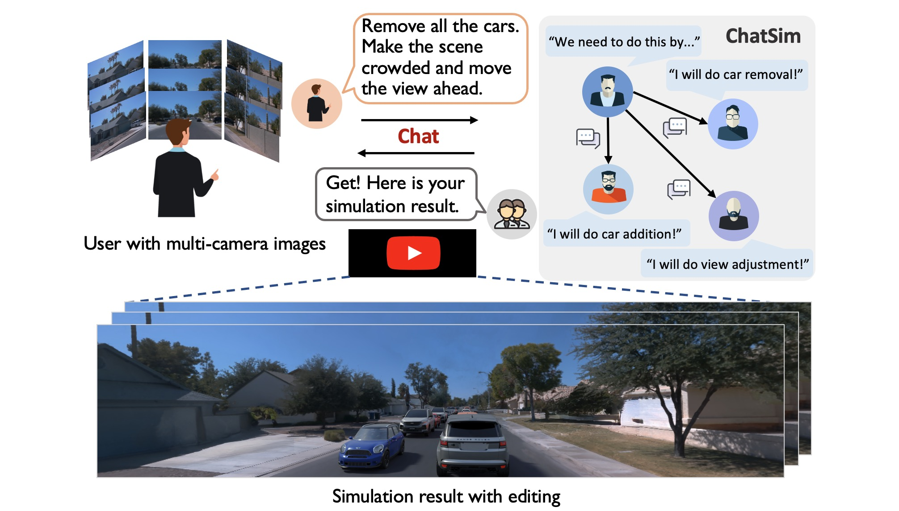
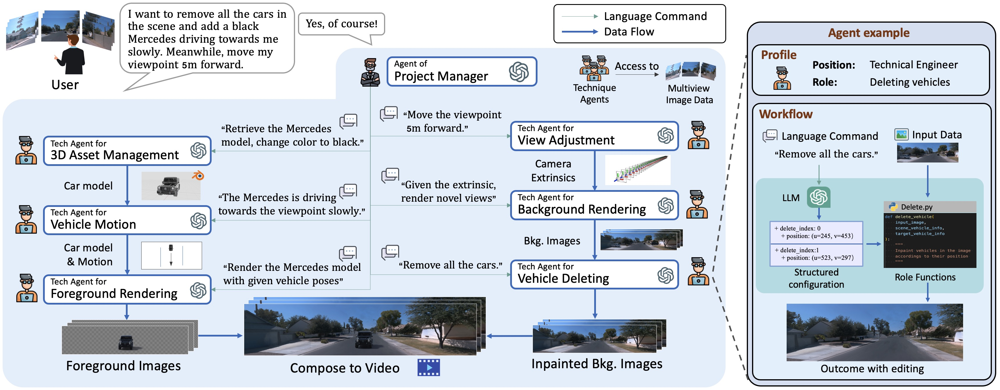

# ChatSim
ChatSim: Editable Scene Simulation for Autonomous Driving via LLM-Agent Collaboration

## Abstract
Scene simulation in autonomous driving has gained significant attention because of its huge potential for generating customized data. 
However, existing editable scene simulation approaches face limitations in terms of user interaction efficiency, 
multi-camera photo-realistic rendering and external digital assets integration. 
To address these challenges, this paper introduces <b><i>ChatSim</i></b>, the first system that enables editable photo-realistic 
3D driving scene simulations via natural language commands with external digital assets. To enable editing with 
high command flexibility, ChatSim leverages a large language model (LLM) agent collaboration framework. 
To generate photo-realistic outcomes, ChatSim employs a novel multi-camera neural radiance field method. 
Furthermore, to unleash the potential of extensive high-quality digital assets, ChatSim employs a novel 
multi-camera lighting estimation method to achieve scene-consistent assets' rendering. Our experiments 
on Waymo Open Dataset demonstrate that ChatSim can handle complex language commands and generate 
corresponding photo-realistic scene videos.

## LLM Collaboration Framework
To address complex or abstract user commands effectively, <b><i>ChatSim</i></b> adopts a large language model 
(LLM)-based multi-agent collaboration framework. The key idea is to exploit multiple LLM agents, 
each with a specialized role, to decouple an overall simulation demand into specific editing tasks, 
thereby mirroring the task division and execution typically founded in the workflow of a human-operated 
company. This workflow offers two key advantages for scene simulation. First, LLM agents' ability to 
process human language commands allows for intuitive and dynamic editing of complex driving scenes, 
enabling precise adjustments and feedback. Second, the collaboration framework enhances simulation 
efficiency and accuracy by distributing specific editing tasks, ensuring improved task completion rates.

## Results
### Example 1 (highly abstract command)

**User command:** _"Create a traffic jam."_

https://github.com/yifanlu0227/ChatSim/assets/45688237/0b7e59bb-98a0-4dfc-9e76-c18a0af9d468

### Example 2 (complex command)

**User command:** _"Remove all cars in the scene and add a Porsche driving the wrong way toward me fast. 
            Additionally, add a police car also driving the wrong way and chasing behind the Porsche. 
            The view should be moved 5 meters ahead and 0.5 meters above."_

https://github.com/yifanlu0227/ChatSim/assets/45688237/7405b132-254c-4da8-9c60-ccb09c8ae415

### Example 3 (multi-round command)

**User command (round 1):** _"Ego vehicle drives ahead slowly. Add a car to the close front that is moving ahead."_

https://github.com/yifanlu0227/ChatSim/assets/45688237/5d7af4bf-65c3-4021-8f83-55a7245bf032

**User command (round 2):** _"Modify the added car to turn left. Add another Chevrolet to the front of the added one."_

https://github.com/yifanlu0227/ChatSim/assets/45688237/810035be-9407-4654-8b36-d5fa0f8c8128

**User command (round 3):** _"Add another vehicle to the left of the Mini driving toward me."_

https://github.com/yifanlu0227/ChatSim/assets/45688237/946c0490-5e86-4be2-872d-56a6c6b963c2

---

### Foreground rendering component
ChatSim adopts a novel multi-camera lighting estimation. With predicted environment lighting, we use **Blender** to render the scene-consistent foreground objects.

https://github.com/yifanlu0227/ChatSim/assets/45688237/cc51aa7e-c26a-4050-b09a-c2d53901090b

### Background rendering component
ChatSim introduces an innovative multi-camera radiance field approach to tackle the challenges of **inaccurate poses** and **inconsistent exposures** among surrounding cameras in autonomous vehicles. This method enables the rendering of ultra-wide-angle images that exhibit consistent brightness across the entire image.

https://github.com/yifanlu0227/ChatSim/assets/45688237/f2a3eabf-6ecb-49d4-8c5d-b781ef99ed40

## Todo
- [ ] Arxiv paper release 
- [ ] Code release
- [ ] Data and model release
