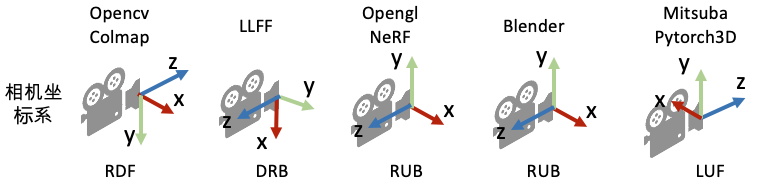
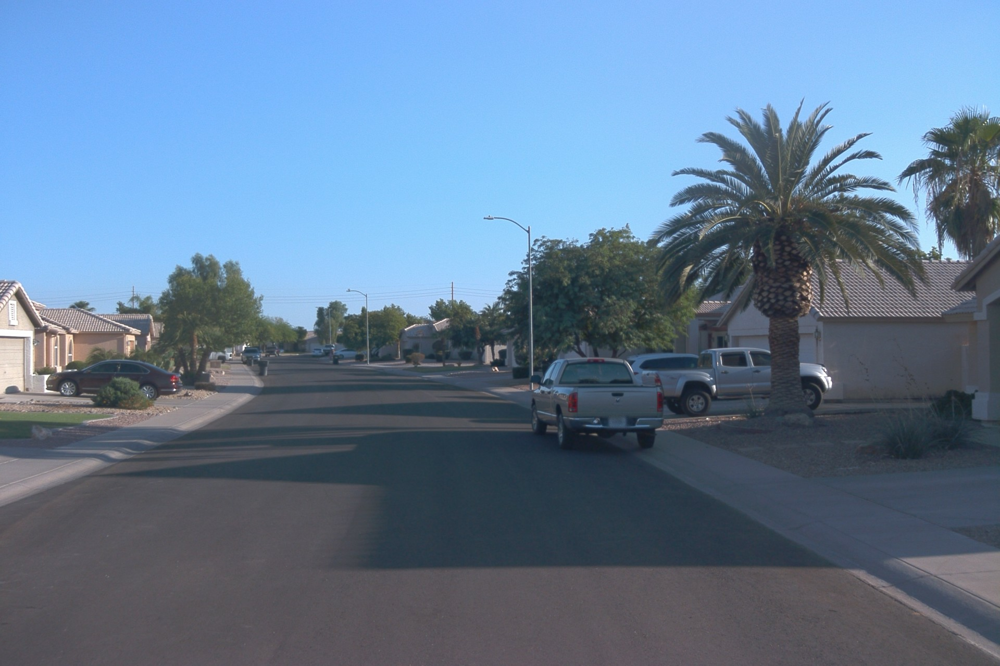
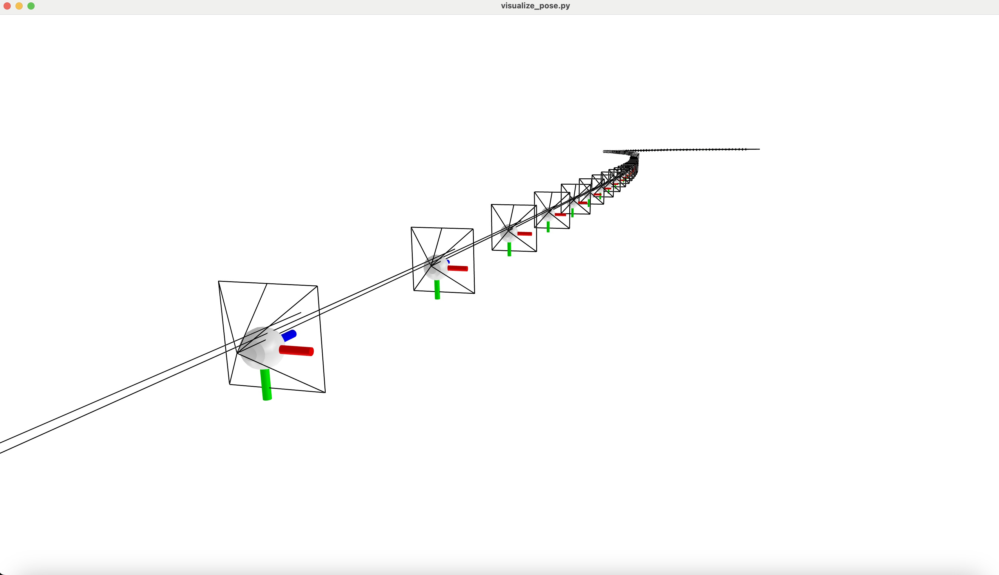
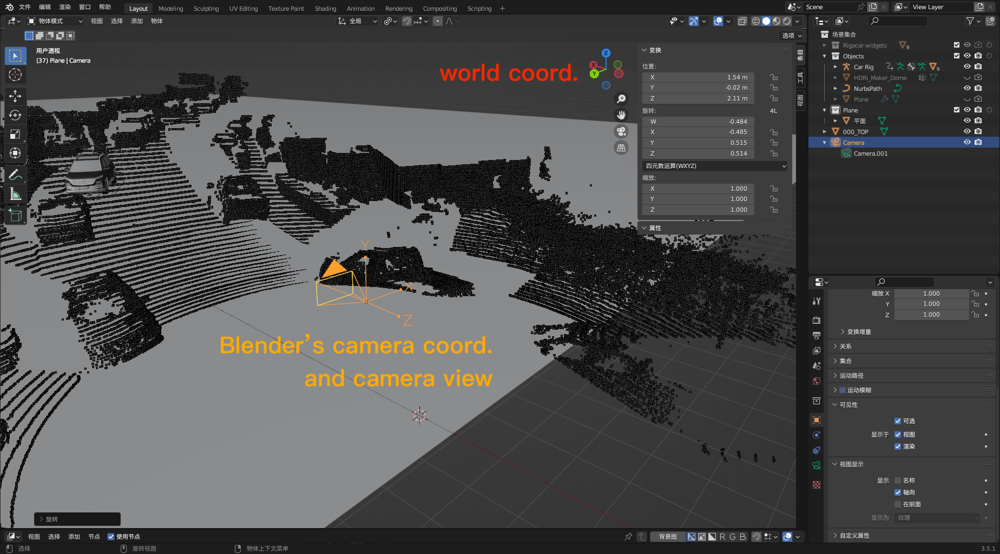

# BlenderUtils
This repo provides a CLI tool for Blender rendering without opening Blender GUI.

## Installation

### Download/Install Blender
[Official Download](https://www.blender.org/download/)

Blender 3.0+ is recommended. 

Note that Blender 3.0+ required at least Ubuntu 20.04. (GLIBC_2.28)


### Find Blender Python 
You can run this in Blender's python interactive console. But if you can find blender python path directly, just go to edit bashrc.
```
import sys
python_exe = os.path.join(sys.prefix,  'bin', 'python3.10')
```
It is located at `/usr/local/blender-3.5.1-linux-x64/3.5/python/bin/python3.10` in my PC. 

### Edit ~/.bashrc to create a shortcut
```
alias blender='/usr/local/blender-3.5.1-linux-x64/blender'
alias blender_python='/usr/local/blender-3.5.1-linux-x64/3.5/python/bin/python3.10'
```

### Install This Repo for Blender Python
```
git clone https://github.com/yifanlu0227/BlenderUtils.git
cd BlenderUtils
blender_python setup.py develop
```


### Install Package for Blender Python (Example)
#### From command line

```
blender_python -m pip install package-name
```
#### From python script 

```
import subprocess
import sys
import os

# 2. path to python
python_exe = os.path.join(sys.prefix,  'bin', 'python3.10')
# 3. upgrade pip
subprocess.call([python_exe, "-m", "ensurepip"])
subprocess.call([python_exe, "-m", "pip", "install", "--upgrade", "pip"])
# 4. install required packages
subprocess.call([python_exe, "-m", "pip", "install", "pyquaternion"])
# 5. use tsinghua mirror
#subprocess.call([python_exe, "-m", "pip", "install", "package_name",  "-i", "https://pypi.tuna.tsinghua.edu.cn/simple"])
```

### Install Requirement for BlenderUtils
1. Python package requirement.
```bash
blender_python -m pip install imageio
blender_python -m pip install numpy
blender_python -m pip install pyyaml
blender_python -m pip install pyquaternion
```
2. [imageio requirement](https://blog.csdn.net/bby1987/article/details/105826595): To read .exr file, need FreeImage library. You can obtain it with either:
- download in terminal:
 
    ```imageio_download_bin freeimage```
- download in python CLI: 

    ```import imageio; imageio.plugins.freeimage.download()```


## Usage 
### Virtual Object Insertion
Look at the yaml file, for example: config/chevrolet_red.yaml
``` yaml
# name for this rendering pass, also the name of output folder
render_name: multi_demo_1346
# name of output directory
output_dir: /home/yfl/workspace/BlenderUtils/output

# path to scene file.
scene_file: "/home/yfl/blender/waymo_sunny/segment-13469905891836363794_4429_660_4449_660_with_camera_labels/data.npz"
# start with an empty scene
blender_file: None
# Path to environment HDRI file. It is supposed to be generated by the lighting estimation algorithm. 
hdri_file: /home/yfl/workspace/dataset_ln/HDR_ours/train/abandoned_parking_1k.exr

# cars are stored in the list
cars: 
  - new_obj_name: chevrolet1 # should be different across each instance

    # blender model file path
    blender_file: /home/yfl/workspace/BlenderUtils/assets/chevrolet-suv-rigged.blend

    # inserting position of the virtual object. Coordinate follows the scene_file.
    insert_pos:
      - 37
      - 7
      - 0

    # inserting heading of the virtual object. Coordinate follows the scene_file. Radians.
    insert_rot: # rad
      - 1.5708  # model-specfic
      - 0       # model-specfic
      - 0       # car heading.

    # object name within blender_file, always "Car"
    model_obj_name: Car 

    # Optional. You can change the color of the car painting.
    # If added, it will change the car body's color to the given color.
    # material_key is always 'car_paint'
    target_color: 
      material_key: car_paint # always car_paint
      color: [0.2, 0.85, 0.05, 1]
    
  - new_obj_name: range_rover1
    blender_file: /home/yfl/workspace/BlenderUtils/assets/Range_Rover_Sports_2018.blend
    insert_pos:
      - 30.6
      - 10
      - 0
    insert_rot: 
      - 0
      - 0
      - 0
    model_obj_name: Car 
    target_color: 
      material_key: car_paint
      color: [0.9, 0.05, 0.05, 1]
  
  - ...
```

### Explanation of scene_file
It is stored in a npz file, and should include keys like:

- H: Height of rendered image. The same as height of images in the dataset. e.g. 1280 for waymo
- W: Width of rendered image. The same as Width of images in the dataset. e.g. 1920 for waymo
- focal: Focal length in unit of pixel.
- rgb: The background image of virutal object insertion. np.ndarray with dtype=int8, shape=[H, W, 3]. Can be rendered results from NeRF.
- depth: The depth of background. np.ndarray with dtype=float32, shape=[H, W]. Can be rendered results from NeRF.
- extrinsic: camera2world transformation matrix, corresponding to this background image. np.ndarray with dtype=float32, shape=[4, 4]. OpenCV camera coordinate (RDF). Also the pose of camera in world coordinate.

### Usage
Once you have the yaml and the scene/blender/hdri files needed inside the yaml. You can render the results with:
```bash
blender -b --python blender_utils/main_multicar.py -- config/1346_multi_car_demo.yaml
```

Note that the x,y euler of `insert_rot` is model-specific currently. For example, chevrolet is not consistent with others, require insert_rot[0] = 1.507. I shall fix it later.

To render a single car, use main.py. It would be deprecated later.
```bash
blender -b --python blender_utils/main.py -- config/single_car/chevrolet.yaml
```

In the output folder, you will see
```
├── backup
│   ├── hdri.exr
│   └── RGB.png
├── depth
│   └── vehicle_and_plane0001.exr
├── label.yaml
├── mask
│   └── vehicle_and_shadow0001.exr
├── RGB
│   └── vehicle_and_shadow_over_background0001.png
├── RGB_composite.png
└── RGB_over_background.png
```

`RGB_composite.png` is the final inserted result.

### Special Explantation for Extrinsic in scene_file


OpenCV camera coordinate: **RDF**

Blender camera coordinate: **RUB**

We suppose the extrinsic follows **OpenCV camera coordinate**. It will be transformed to Blender camera coordiniate automatically in the `get_rotation_quaternion` function in `blender_utils/camera/set_camera.py`. *But which is the most convenient camera coordinate system for you guys? Please let me know.*

For example, the waymo scene 1346, camera trajectory is as follows: 

| |  |  |
| -------------------------------------------- | -------------------------------------------- | -------------------------------------------- |

Note the world coordinate (the big box) and the OpenCV camera coordinate (the small axis) in **RDF**.

Now have a look at the camera transformed into blender camera coordinate system in **RUB**. For example, the waymo scene 1024:




### Sync 3D Assets
stored in 303A PC /home/yfl/workspace/BlenderUtils/assets

In 303A PC's terminal, use scp to upload these files:
```
scp -r /home/yfl/workspace/BlenderUtils/assets <HPC username>@sydata.hpc.sjtu.edu.cn:<BlenderUtils PATH in HPC>
```