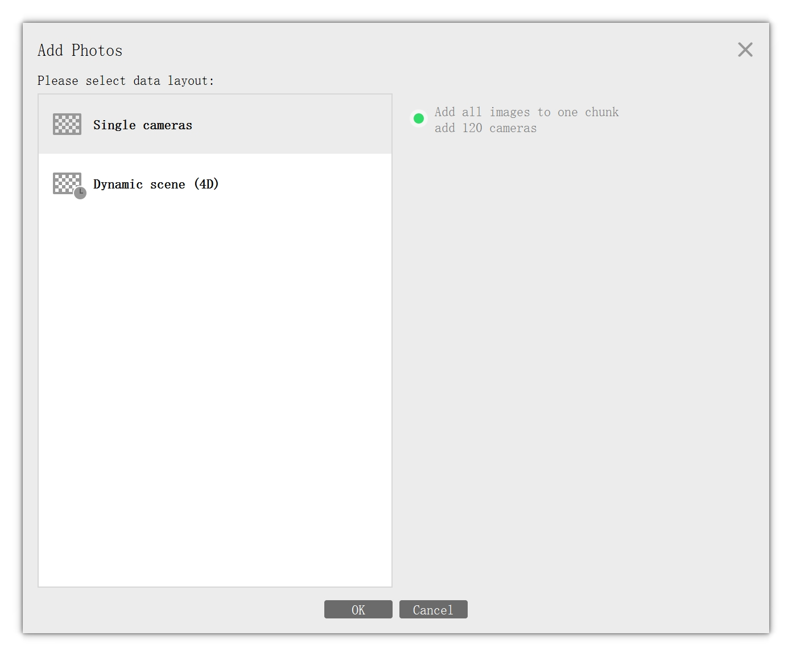
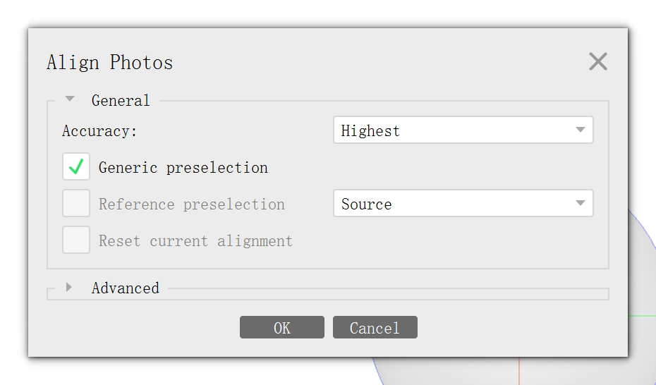

# Multi camera alignment

We first extract data (images, LiDAR, camera poses, bboxes, map data) from tfrecord files. We set the first vehicle's coordinate as a new world's coordinate.

Then we use existing SfM software to reclibrate the images and transform the sfm poses back to waymo's coordinate (real-world scale). **COLMAP** and **Metashape** are supported. Since **COLMAP** is open-source and easy to install, we suggest users to use COLMAP in Step 2.

### Step 1: Waymo Data Extraction 
```
python process_waymo_script.py --waymo_data_dir=../data/waymo_tfrecords/1.4.2 --nerf_data_dir=../data/waymo_multi_view
```

### Step 2: Using COLMAP or Metashape to calibrate images


<details>
<summary>COLMAP usage</summary>

#### Step 2.2: Run COLMAP sparse reconstruction:
```shell
bash data_utils/local_colmap.sh ../data/waymo_multi_view/{SCENE_NAME}
```

This will generate `sparse/0` folder in your `../data/waymo_multi_view/{SCENE_NAME}`
</details>

<details>
<summary>Metashape usage</summary>

### Step 2: Using Metashape to calibrate images and get `camera.xml`

#### Step 2.1: Use `Workflow->Add Folder` to upload the images from `data/waymo_multi_view/{SCENE_NAME}/images`, and then choose `Single Cameras` as follows:


#### Step 2.2: Use `Workflow->Align Photos` to calibrate the images with the following configuration:


#### Step 2.3: Use `File->Export->Export Cameras` to export the parameters of cameras. Put them in folder `data/waymo_multi_view/{SCENE_NAME}`.
</details>

### Step 3: Convert to waymo coordinate (real-world scale)

If you use COLMAP in Step 2, run the following command
```bash
python convert_to_waymo_script.py --datadir=../data/waymo_multi_view --calibration_tool=colmap
```

If you use Metashape in Step 2, change `--calibration_tool=metashape`

```bash
python convert_to_waymo_script.py --datadir=../data/waymo_multi_view --calibration_tool=metashape
```

