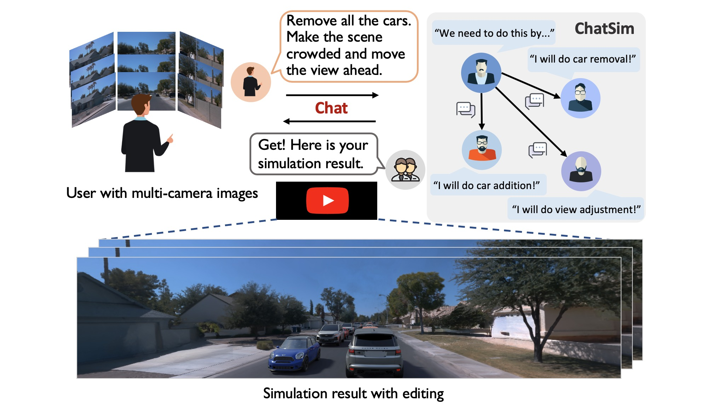

# ChatSim
Editable Scene Simulation for Autonomous Driving via LLM-Agent Collaboration

[Arxiv](https://arxiv.org/abs/2402.05746) | [Project Page](https://yifanlu0227.github.io/ChatSim/)



## Requirement
- Ubuntu version >= 20.04 (for using Blender 3.+)
- Metashape software

## Installation
First clone this repo recursively.

```bash
git clone https://github.com/yifanlu0227/ChatSim.git --recursive
```

### Step 1: Setup environment
```
conda create -n chatsim python=3.8
conda activate chatsim

pip install torch==1.13.1+cu117 torchvision==0.14.1+cu117 torchaudio==0.13.1 --extra-index-url https://download.pytorch.org/whl/cu117
pip install -r requirements.txt
imageio_download_bin freeimage
```

### Step 2: Install McNeRF 
The installation is the same as [F2-NeRF](https://github.com/totoro97/f2-nerf). Please go through the following steps.

```bash
cd chatsim/background/mcnerf/

# mcnerf use the same data directory. 
ln -s ../../../data .
```

#### Step 2.1: Install dependencies

For Debian based Linux distributions:
```
sudo apt install zlib1g-dev
```

For Arch based Linux distributions:
```
sudo pacman -S zlib
```

#### Step 2.2: Download pre-compiled LibTorch
Taking `torch-1.13.1+cu117` for example.
```shell
cd chatsim/background/mcnerf
cd External

wget https://download.pytorch.org/libtorch/cu117/libtorch-cxx11-abi-shared-with-deps-1.13.1%2Bcu117.zip
unzip ./libtorch-cxx11-abi-shared-with-deps-1.13.1+cu117.zip
rm ./libtorch-cxx11-abi-shared-with-deps-1.13.1+cu117.zip
```

#### Step 2.3: Compile
The lowest g++ version is 7.5.0. 
```shell
cd ..
cmake . -B build
cmake --build build --target main --config RelWithDebInfo -j
```

### Step 3: Install Inpainting tools

#### Step 3.1: Setup Video Inpainting
```bash

cd ../inpainting/Inpaint-Anything/
python -m pip install -e segment_anything
```
Go [here](https://drive.google.com/drive/folders/1ST0aRbDRZGli0r7OVVOQvXwtadMCuWXg?usp=sharing) to download [pretrained_models](https://drive.google.com/drive/folders/1wpY-upCo4GIW4wVPnlMh_ym779lLIG2A?usp=sharing), put the directory into `./` and get `./pretrained_models`. Additionally, download [pretrain](https://drive.google.com/drive/folders/1SERTIfS7JYyOOmXWujAva4CDQf-W7fjv?usp=sharing), put the directory into `./pytracking` and get `./pytracking/pretrain`.

#### Step 3.2: Setup Image Inpainting
```bash
cd ../latent-diffusion
pip install -e git+https://github.com/CompVis/taming-transformers.git@master#egg=taming-transformers
pip install -e git+https://github.com/openai/CLIP.git@main#egg=clip
pip install -e .

# download pretrained ldm
wget -O models/ldm/inpainting_big/last.ckpt https://heibox.uni-heidelberg.de/f/4d9ac7ea40c64582b7c9/?dl=1
```

### Step 4: Install Blender Software and our Blender Utils
We tested with [Blender 3.5.1](https://download.blender.org/release/Blender3.5/blender-3.5.1-linux-x64.tar.xz). Note that Blender 3+ requires Ubuntu version >= 20.04.

#### Step 4.1: Install Blender software
```bash
cd ../../Blender
wget https://download.blender.org/release/Blender3.5/blender-3.5.1-linux-x64.tar.xz
tar -xvf blender-3.5.1-linux-x64.tar.xz
rm blender-3.5.1-linux-x64.tar.xz
```

#### Step 4.2: Install blender utils for Blender's python
locate the internal Python of Blender, for example `blender-3.5.1-linux-x64/3.5/python/bin/python3.10`

```bash
export blender_py=$PWD/blender-3.5.1-linux-x64/3.5/python/bin/python3.10

cd utils

# install dependency (use the -i https://pypi.tuna.tsinghua.edu.cn/simple if you are in the Chinese mainland)
$blender_py -m pip install -r requirements.txt 
$blender_py -m pip install -r requirements.txt -i https://pypi.tuna.tsinghua.edu.cn/simple

$blender_py setup.py develop
```

### Step 5: Install McLight (optional)
If you want to train the skydome model, install this submodule and follow the readme `chatsim/foreground/mclight/skydome_lighting/readme.md`. You can now use our provided HDRI and skip this step.
```bash
cd ../../../foreground/mclight/skydome_lighting/

python setup.py develop
```

You are all set!

## Usage

### Data Preparation

#### Download and extract waymo data
```bash
mkdir data
mkdir data/waymo_tfrecords
mkdir data/waymo_tfrecords/1.4.2
```
Download the [waymo perception dataset v1.4.2](https://waymo.com/open/download/) to the `data/waymo_tfrecords/1.4.2`. You should see file structures like 

```
data
|-- ...
|-- ...
`-- waymo_tfrecords
    `-- 1.4.2
        |-- segment-10247954040621004675_2180_000_2200_000_with_camera_labels.tfrecord
        |-- segment-11379226583756500423_6230_810_6250_810_with_camera_labels.tfrecord
        `-- segment-1172406780360799916_1660_000_1680_000_with_camera_labels.tfrecord
```
We extract the images, camera poses, LiDAR file, etc. out of the tfrecord files with the `data_utils/process_waymo_script.py`. 

```bash
cd data_utils
python process_waymo_script.py --waymo_data_dir=../data/waymo_tfrecords/1.4.2 --nerf_data_dir=../data/waymo_multi_view
```
This will generate the data folder `data/waymo_multi_view`. 

#### Recalibrate waymo data (or just download our recalibrated files)
Use Metashape to calibrate images in the `data/waymo_multi_view/{SCENE_NAME}/images` folder and convert them back to the waymo world coordinate. Please follow the tutorial in `data_utils/README.md`. And the final camera extrinsics and intrinsics are stored as `cam_meta.npy`.

Download our recalibrated files [here](url).

### Inference

#### Download pretrain for quick start-up
You need to train the McNeRF model for each scene as well as the McLight's skydome estimation network. To get started quickly, you can download our pretrained files. The tutorial of training from scratch will be put in the next section.

- [McNeRF pretrain models](url). Download and put them in `chatsim/background/mcnerf/exp`
- [Skydome HDRI](url). Download and put them in `data/waymo_skydome`
- [Blender Assets](url). Download and put them in `data/blender_assets`


#### Start simulation

Now you can start the simulation with
``` bash
python main.py -y ${CONFIG YAML} \
               -p ${PROMPT} \
               -s ${SIMULATION NAME}
```

- `${CONFIG YAML}` specifies the scene information, and yamls are stored in `config` folder. e.g. `config/waymo-1137.yaml`.

- `${PROMPT}` is your input prompt, which should be wrapped in quotation marks. e.g. `add a straight driving car in the scene`.

- `${SIMULATION NAME}` determines the name of the folder when saving results. default `demo`.

You can try
``` bash
python main.py -y config/waymo-1137.yaml -p 'add a straight driving car in the scene' -s demo
```

The rendered results are saved in `results/1137_demo_%Y_%m_%d_%H_%M_%S`. Intermediate files are saved in `results/cache/1137_demo_%Y_%m_%d_%H_%M_%S` for debug and visualization if `save_cache` are enabled in `config/waymo-1137.yaml`.

#### Config file explanation
`config/waymo-1137.yaml` contains the detailed explanation for each entry. 


### Train McNeRF
```
cd chatsim/background/mcnerf
```
Make sure you have the `data` folder linking to `../../../data`, and train your model with 

```
python scripts/run.py --config-name=wanjinyou_big \
dataset_name=waymo_multi_view case_name=${CASE_NAME} \
exp_name=${EXP_NAME} dataset.shutter_coefficient=0.1 mode=train_hdr_shutter +work_dir=$(pwd) 
```
where `${CASE_NAME}` are those like `segment-11379226583756500423_6230_810_6250_810_with_camera_labels` and `${EXP_NAME}` can be anything like `exp_0302_coeff_0.1`.

You can also modify and run the `train.sh` and `render_novel_view.sh`.


### Train McLight's Skydome estimation network
Go to `chatsim/foreground/mclight/skydome_lighting` and follow `chatsim/foreground/mclight/skydome_lighting/readme.md` for the training.


## Citation
```
@misc{wei2024editable,
      title={Editable Scene Simulation for Autonomous Driving via Collaborative LLM-Agents}, 
      author={Yuxi Wei and Zi Wang and Yifan Lu and Chenxin Xu and Changxing Liu and Hao Zhao and Siheng Chen and Yanfeng Wang},
      year={2024},
      eprint={2402.05746},
      archivePrefix={arXiv},
      primaryClass={cs.CV}
}
```